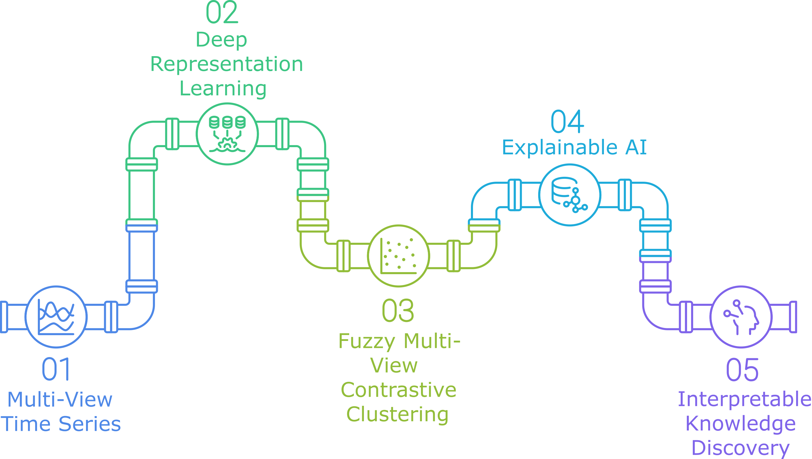
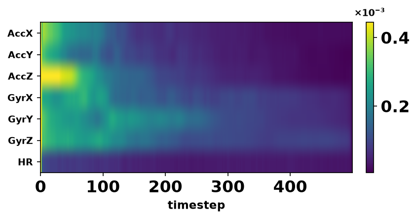
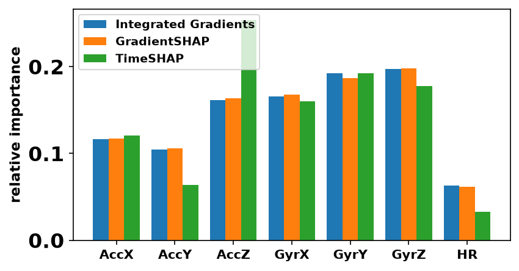
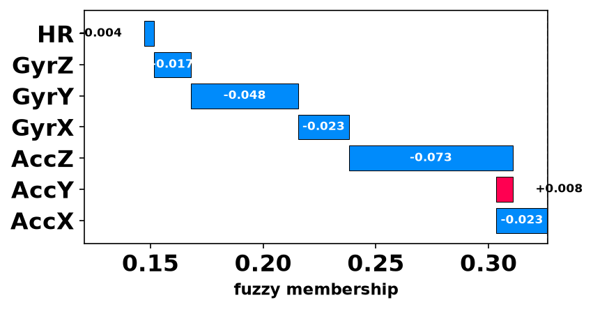
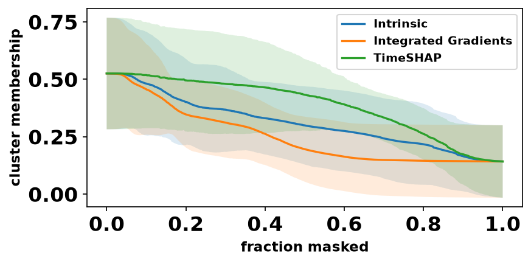
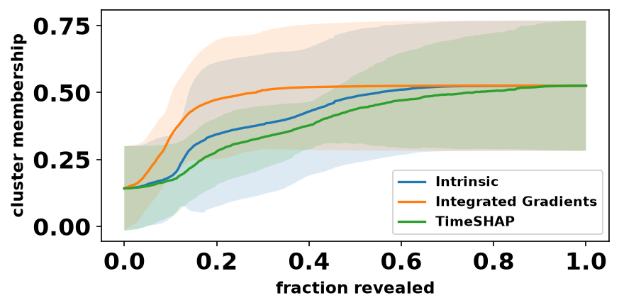
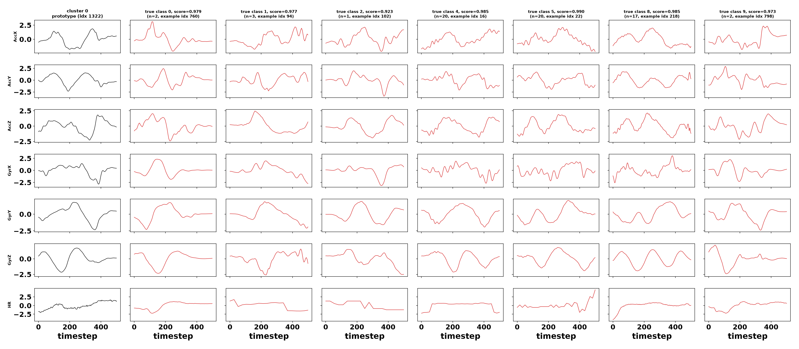
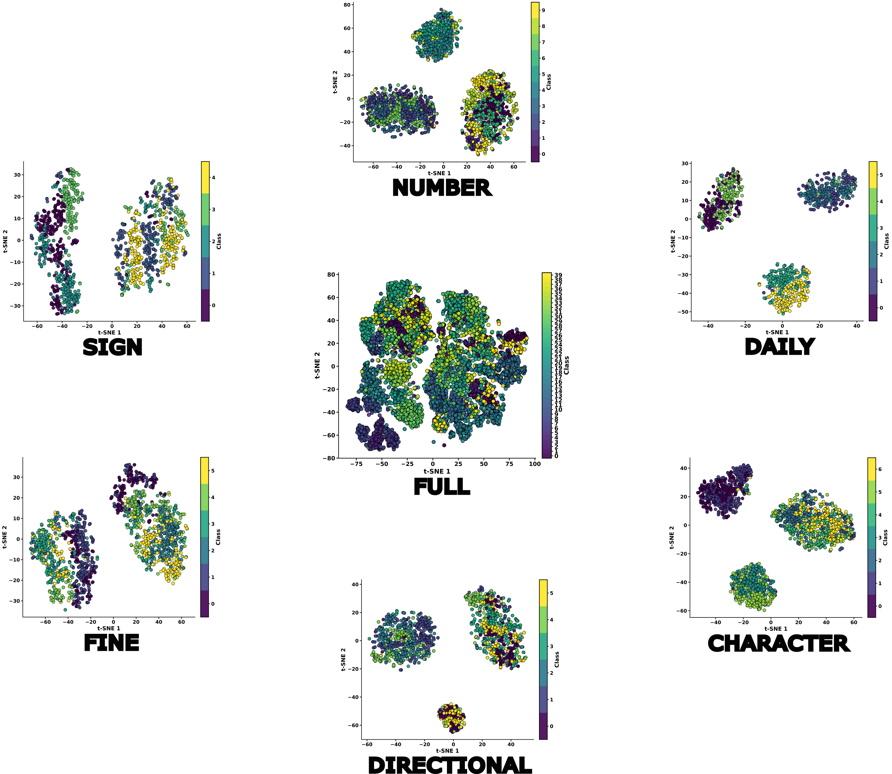
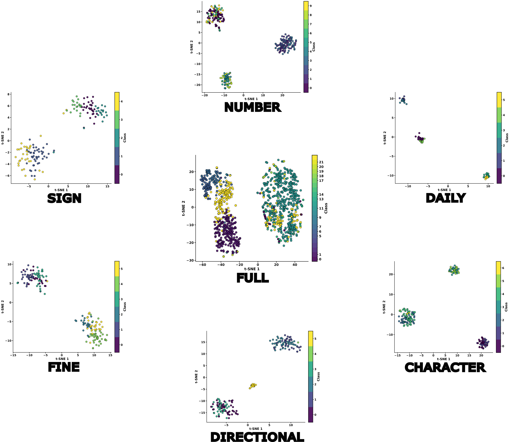

# Interpreting FMMVCC: An Explainability Framework for Deep Time-Series Clustering

This repository provides a comprehensive explainability (XAI) framework for deep clustering of multivariate time series. The framework is demonstrated on FMMVCC, a fuzzy Mamba-based multi-view contrastive clustering model, and combines intrinsic explanations with post-hoc attribution methods to interpret cluster assignments.



---

## 🔎 Overview

`FMMVCC_Model` (`fmmvcc.py`) couples a multi-view Mamba encoder with a fuzzy
c-means clustering head:

- 🪟 **Multi-view encoding** — `encode_views()` applies stochastic masking
  to the *same* input signal to produce several augmented copies 
  (default **4 views**), each routed through its own encoder branch.
- 🐍 **Mamba encoder** — `models/encoder.py` stacks Mamba blocks (RMSNorm,
  unidirectional by default). The package is loaded from the local `./mamba/`
  clone of [state-spaces/mamba](https://github.com/state-spaces/mamba).
- 🎯 **Fuzzy clustering head** — `predict_membership(x)` returns a soft membership
  vector `[B, num_cluster]` from the pooled latent representation and the learned
  fuzzy centroids `u_mean`.

## 📂 Repository layout

| Path | Purpose |
|------|---------|
| `main.py` | Training / clustering entry point. |
| `main_xai.py` | **Single entry point for all XAI** (intrinsic + Captum + TimeSHAP + fidelity). |
| `fmmvcc.py` | Model definition, `predict_membership`, `load_for_xai`. |
| `models/` | Mamba encoder and metrics. |
| `mamba/` | Local clone of the `mamba_ssm` package (no pip install needed). |
| `eda_wrigest.py` | Exploratory data analysis / preprocessing for the WriGest dataset. |
| `utils.py`, `datautils.py`, `tools/` | Dataset loading, latent-space plotting, helpers. |

## ⚙️ Environment

The project runs inside a CUDA container built from `dockerimg/Dockerfile`, orchestrated by `docker-compose.yml`:

```bash
docker compose up -d          # build + start the JupyterLab container
```

`mamba_ssm` is **not** installed via pip — the local `./mamba/` folder is used
instead (a pure-PyTorch fallback path works on CUDA without `causal_conv1d`).

## 🚀 Training

```bash
# Train on the full WriGest dataset
CUDA_VISIBLE_DEVICES=1 python main.py --dataset-name WriGest

# Train on a single WriGest macro category (see category.txt)
python main.py --dataset-name WriGest --wrigest-macro-category Directional
```

## 🧠 Explainability (XAI)

`main_xai.py` runs the whole XAI battery in one pass. Every optional block is
**opt-in** via a `--with-*` flag:

```bash
python main_xai.py --dataset-name <name> \
    --with-captum --with-timeshap --with-fidelity
```

The pipeline produces:

1. 🧩 **Intrinsic FMMVCC XAI** (always on) — membership heatmaps, prototype paths,
   view-ablation importance, nearest-medoid prototypes, cluster purity.
2. 📈 **Captum gradient attributions** (`--with-captum`) — Integrated Gradients,
   GradientShap, Occlusion on `predict_membership(x)[:, target_cluster]`.
3. 🔬 **TimeSHAP** (`--with-timeshap`) — event / feature / cell-level attribution,
   plus cross-method correlation against the intrinsic weights.
4. ✅ **Fidelity & stability** (`--with-fidelity`) — deletion/insertion AUC and
   cross-seed stability for every attribution method.

### 🖼️ Example

#### 🧭 Directional

<p align="center">
  
  
  
</p>

<p align="center">
  <em>IG heatmap · Channel importance · TimeSHAP force plot</em>
</p>

<p align="center">
  
  
</p>

<p align="center">
  <em>Deletion fidelity · Insertion fidelity</em>
</p>

<p align="center">
  
</p>

<p align="center"><em>Cluster prototypes</em></p>

## 📥 **WriGest data (Zenodo):**
[https://zenodo.org/records/20117155](https://zenodo.org/records/20117155)

Experiments use the **WriGest** dataset in **7 configurations**: the full
40-class set + 6 macro categories (Directional, Number, Character, Sign, Fine,
Daily — see `category.txt`). WriGest is a 7-channel wrist-worn IMU + heart-rate 
gesture dataset (40 gesture classes, grouped into 6 macro categories).

📥 The dataset is available on Zenodo:
[https://zenodo.org/records/20117155](https://zenodo.org/records/20117155)

The learned latent space, projected for the train and test splits, shows
well-separated gesture clusters:

**🟢 Train latent space**



**🔵 Test latent space**



---

## 💎 Acknowledgment

This work was supported by the MSCA Doctoral Networks project **T.U.A.I. —
Towards an Understanding of Artificial Intelligence via a transparent, open and
explainable perspective (TUAI)**, N°101168344.
